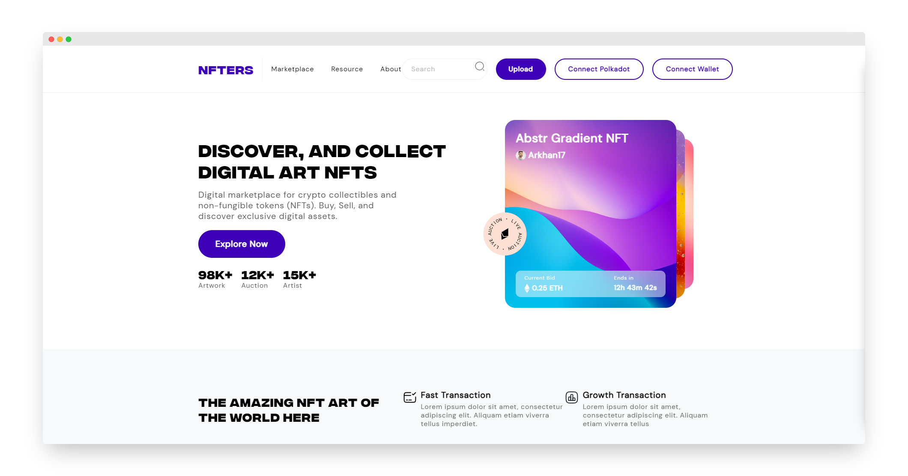

<p align="center">
  <a href="https://www.ternoa.network/">
    <picture>
      <source media="(prefers-color-scheme: dark)" srcset="./assets/ternoa.svg">
      
    </picture>
    <h3 align="center">Assessment</h3>
  </a>
</p>

<p align="center">
  <a aria-label="Made by Antoine Kingue" href="https://antoinek.fr">
    
  </a>
  <a aria-label="License" href="https://github.com/antoinekm/ternoa-assessment/blob/master/LICENSE">
    
  </a>
</p>

Ternoa assessment for the position of Senior Developer.

## Getting Started

This project is made with [Turborepo](https://turbo.build/repo) and [Yarn](https://yarnpkg.com/).

1. Clone the repository

```bash
git clone https://github.com/AntoineKM/ternoa-assessment
```

2. Go to the project directory

```bash
cd ternoa-assessment
```

3. Install dependencies

```bash
yarn install
```

4. Now you can use the following commands:

- `yarn dev` - Runs `turbo dev` to start turborepo in development mode
- `yarn build` - Runs `turbo build` to build the project
- `yarn start` - Runs `turbo start` to start turborepo in production mode (only after `yarn build`)
- `yarn lint` - Runs `eslint` to lint the project

### Apps

For more details and the choices I made visit each app:

- [api](./apps/api) - Express API
- [contracts](./apps/contracts) - Smart contracts
- [native](./apps/native) - Expo app
- [web](./apps/web) - Next.js app

## Demo

Visit [live demo](https://nft.hop.sh) to see the project in action.

[](https://nft.hop.sh)

## Root choices

- Turborepo - To manage the monorepo
- Yarn - To manage the dependencies (I would have preferred to use pnpm but there are still issues with expo and monorepos)
- ESLint - To lint the code (with my own config)
- Prettier - To format the code
- Node >=16 - Unfortunately `@polkadot/api` does not support older versions
- Hop - To deploy the project for free

To know more about the choices I made for each app [visit their README's](#apps).

## License
[MIT](LICENSE)
